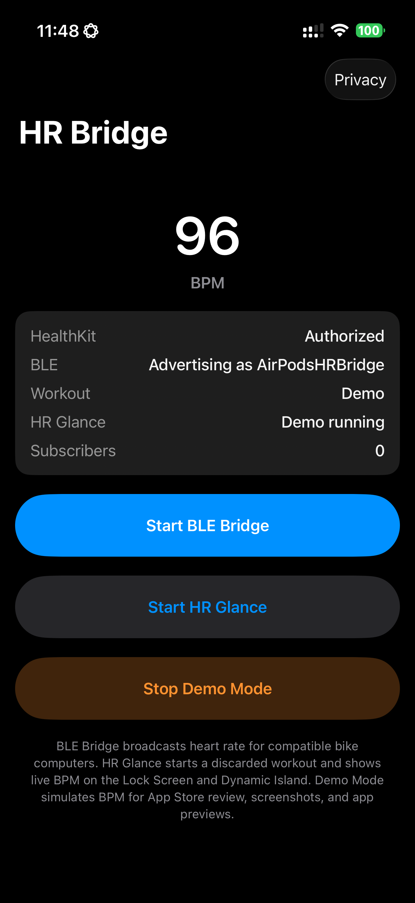
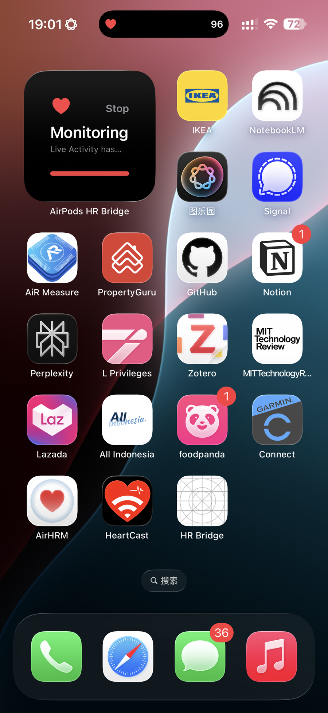
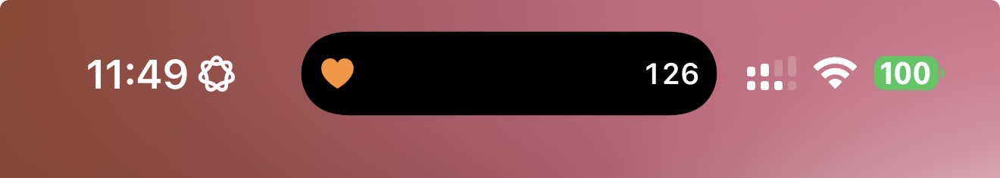
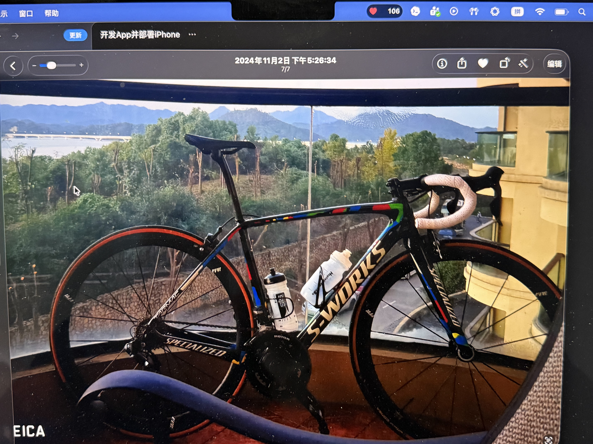

# AirPods HR Bridge

AirPods HR Bridge is a small iPhone app for turning compatible AirPods heart-rate data into something easier to use:

- **BLE Bridge** broadcasts live BPM as the standard Bluetooth LE Heart Rate Service, so bike computers such as Garmin Edge can pair it like a normal heart-rate strap.
- **HR Glance** starts a lightweight workout session, shows live BPM in the app, Lock Screen Live Activity, and Dynamic Island, then discards the workout on stop.
- **Widget launch** adds a Home Screen / Lock Screen toggle for starting and stopping HR Glance.
- **Demo Mode** simulates BPM for screenshots, demos, setup, and reviewers without AirPods or HealthKit data.

This is a fitness utility and interoperability prototype. It is not a medical device and does not provide medical advice.

## Demo

<table>
  <tr>
    <td align="center">
      <br>
      <sub>App main screen (Demo Mode)</sub>
    </td>
    <td align="center">
      <br>
      <sub>Widget monitoring on Home Screen</sub>
    </td>
  </tr>
  <tr>
    <td colspan="2" align="center">
      <br>
      <sub>Dynamic Island compact view</sub>
    </td>
  </tr>
  <tr>
    <td colspan="2" align="center">
      <br>
      <sub>Cycling context</sub>
    </td>
  </tr>
</table>

## How It Works

```text
Compatible AirPods heart-rate source
    -> HealthKit live workout metrics
    -> iPhone app
       -> HR Glance Live Activity / Dynamic Island
       -> BLE Heart Rate Service 0x180D
    -> Garmin Edge or another BLE heart-rate receiver
```

## Requirements

- iPhone with iOS 26 or later recommended for iPhone workout sessions with compatible AirPods heart-rate sources.
- Compatible AirPods heart-rate source connected to the iPhone.
- Xcode 26 or later recommended.
- Apple Account configured in Xcode.
- A real iPhone. HealthKit, CoreBluetooth peripheral advertising, Live Activities, and widgets are not fully testable in the simulator.

You do not need a paid Apple Developer Program membership for personal Xcode installation on your own device, but free signing has Apple-imposed limits and may require reinstalling after the provisioning profile expires. TestFlight, App Store, and Ad Hoc distribution require paid Apple Developer Program access.

## Configure Signing

The public repo deliberately uses placeholder identifiers:

- App bundle ID: `com.example.AirPodsHRBridge`
- Widget bundle ID: `com.example.AirPodsHRBridge.HRGlanceLiveActivity`
- App Group: `group.com.example.AirPodsHRBridge`
- Development Team: unset

Before installing on your iPhone:

1. Open `AirPodsHRBridge.xcodeproj` in Xcode.
2. Select the `AirPodsHRBridge` app target and set your Team under **Signing & Capabilities**.
3. Change the app bundle identifier to a unique value, for example `com.yourname.AirPodsHRBridge`.
4. Select the `HRGlanceLiveActivity` extension target and set the same Team.
5. Change the extension bundle identifier to the app bundle plus `.HRGlanceLiveActivity`.
6. Update the App Group in both targets, for example `group.com.yourname.AirPodsHRBridge`.
7. Update `Sources/Shared/HRGlanceSharedState.swift` so `appGroupIdentifier` exactly matches that App Group.

Required capabilities:

- HealthKit
- App Groups
- Live Activities
- Background Modes: `bluetooth-peripheral`

## Build And Install

Install from Xcode by selecting a physical iPhone and pressing Run.

Command-line build:

```sh
Scripts/build-device.sh
```

Command-line install after connecting, unlocking, trusting the iPhone, and enabling Developer Mode:

```sh
Scripts/deploy-to-iphone.sh
```

If automatic detection cannot find your team or device, pass them explicitly:

```sh
TEAM_ID=<10-character Team ID> DEVICE_ID=<iPhone UDID> Scripts/deploy-to-iphone.sh
```

## Garmin Edge Pairing

1. Wear compatible AirPods and keep them connected to the iPhone.
2. Open HR Bridge, keep the app in the foreground with the screen unlocked, and tap **Start BLE Bridge**.
3. Allow Health access when prompted.
4. On Edge 530: **Settings -> Sensors -> Add Sensor -> Heart Rate**.
5. Select `AirPodsHRBridge`.
6. Finish first pairing while the app is foregrounded. After first pairing, later reconnects can work while the app is backgrounded or the phone is locked.

The app uses Heart Rate Service UUID `0x180D` and Heart Rate Measurement characteristic UUID `0x2A37`. Measurement packets set the Sensor Contact Supported + Contact Detected flags (`0x06`) and are throttled to about 1 Hz for bike-computer compatibility.

## HR Glance

1. Wear compatible AirPods and keep them connected to the iPhone.
2. Tap **Start HR Glance**.
3. Watch BPM in the app, Lock Screen Live Activity, or Dynamic Island.
4. Tap **Stop HR Glance** when done. The workout builder is discarded so the session should not appear as a saved workout in Apple Health.

The widget is a stable start/stop and monitoring control. Normal widgets are snapshot-based and system-throttled, so the real-time BPM surface is the Live Activity / Dynamic Island.

## Demo Mode

Demo Mode simulates changing BPM without AirPods or HealthKit authorization. It also advertises simulated BLE Heart Rate Service data so pairing flows can be demonstrated with a compatible BLE receiver or scanner.

Demo Mode is clearly labeled in the app and should not be treated as a real measurement.

## Privacy

Heart-rate data is personal health data. This app reads HealthKit heart-rate data only after the user explicitly starts BLE Bridge or HR Glance. It does not upload data to a server, does not include tracking SDKs, and does not use health data for advertising. When BLE Bridge is running, BPM is broadcast locally over Bluetooth so the user's chosen receiver can display it.

See `Docs/PRIVACY_POLICY_DRAFT.md` for a publishable privacy policy draft.

## Acknowledgements

Project design, implementation, debugging, and documentation were developed with AI coding assistance from:

1. OpenAI Codex
2. Claude

Project ownership and publishing remain with `snowyfoams`.

## Distribution Notes

This repository is source-first. Users who install it themselves need Xcode and their own Apple signing identity. Public App Store, TestFlight, and Ad Hoc distribution are separate Apple Developer Program workflows.
